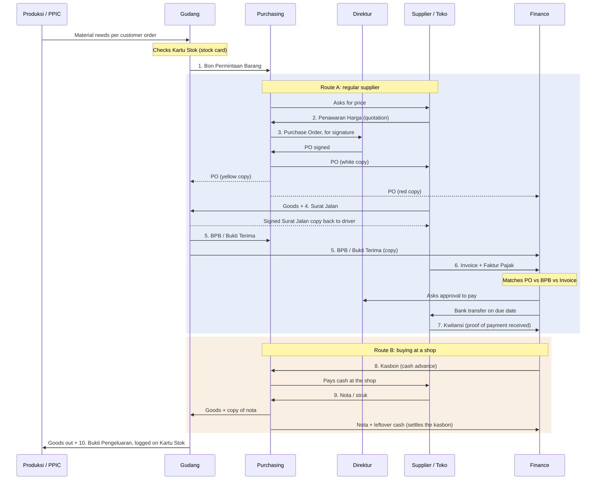
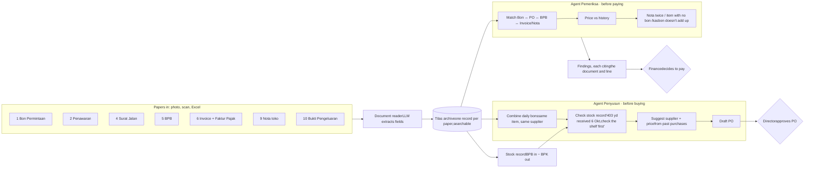

Tilas · field notes for the hackathon

# Purchasing Paper Trail

One fabric purchase and one stationery purchase, followed from the warehouse request to payment. Every document below is a made-up example ("Contoh" names, synthetic numbers) built from the 30 September request file, so you can see what each paper looks like and who hands it to whom.

Diagram 1

## Who sends which document to whom

The standard flow in an Indonesian manufacturer. Route A is for regular suppliers (fabric, thread). Route B is for small cash purchases at a shop (stationery, medicine, plastic bags). Small factories often skip some of these papers. Finding out which ones your uncle's company skips is the most useful thing to ask.

Route A: regular supplier, paid by transfer later Route B: shop purchase, paid in cash Solid arrow = original · dashed = copy

Names that get mixed up

## Same thing, different names

**Goods receipt = Bukti Terima = BPB**

One document. Bukti Penerimaan Barang is written by the warehouse after counting what actually arrived. Small companies often just use the signed surat jalan as their bukti terima.

**Surat Jalan = Delivery Order (DO)**

Made by the supplier, travels with the truck. Lists what was sent, with no prices.

**Invoice = Faktur tagihan ≠ Faktur Pajak**

The invoice asks for money. The faktur pajak is the separate VAT document from the tax system (Coretax), issued only by VAT-registered (PKP) suppliers.

**Nota vs Kwitansi**

A nota lists what you bought and the price. A kwitansi only says "money received from X for Y". Shops often give a nota; suppliers give a kwitansi after a transfer.

The documents

## What each paper looks like

Route A follows the brown and cream Wunder fabric from your file. The warehouse asked for it twice on the same bon (two customer orders), and purchasing combined both lines into one PO. Watch the cream fabric: only 60 of 84 yards arrive, but the invoice bills all 84.

1 · BON PERMINTAAN BARANG

### Material request

Gudang→Purchasing

Purpose

Says what to buy and how much, after subtracting warehouse stock. This is the file you already have.

**Tilas uses it to**

- combine the same item across bons and days
- check the stock record before buying

PT CONTOH BONEKA NUSANTARAGudang Bahan

BON PERMINTAAN BARANGNo. 1 · 30 September 2026

| No | Nama barang | Butuh | Stok | Order | Keterangan |
| --- | --- | --- | --- | --- | --- |
| 1 | WUNDER 200R AD D/BROWN 10MM | 195 yd | – | 195 yd | Otter L · PO cust. 2693 |
| 2 | WUNDER 200R AD CREAM 10MM | 39 yd | – | 39 yd |  |
| 10 | WUNDER 200R AD D/BROWN 10MM | 208 yd | – | 208 yd | Puppet Otter · PO cust. 2693 |
| 11 | WUNDER 200R AD CREAM 10MM | 45 yd | – | 45 yd |  |

Supplier / Harga / Qty / Tgl columns are left blank; purchasing fills them in after buying.

Dibuat (Gudang)

Purchasing

Menyetujui

2 · PENAWARAN HARGA

### Quotation

Supplier→Purchasing

Purpose

The supplier's offer: price, delivery time, payment terms. Often it arrives as a WhatsApp message rather than a letter.

**Tilas uses it to**

- compare the price with past purchases
- record the terms for later matching

CV CONTOH TEKSTILJl. Contoh Raya No. 12, Bandung · PKP

PENAWARAN HARGANo. 112/CT/X/2026 · 1 Oktober 2026

Kepada: PT Contoh Boneka Nusantara

Up: Bagian Purchasing

| Barang | Harga / yard | Stok |
| --- | --- | --- |
| WUNDER 200R AD D/BROWN 10MM | Rp 38.500 | Ready |
| WUNDER 200R AD CREAM 10MM | Rp 38.500 | Ready ± 60 yd |

Harga belum termasuk PPN · Pengiriman 3–5 hari kerja · Pembayaran tempo 30 hari · Berlaku 14 hari

Hormat kami, Marketing

3 · PURCHASE ORDER (PO)

### Official order to the supplier

Purchasing→Supplier+ copies →GudangFinance

Purpose

The company's promise to buy at an agreed price. Once signed by the director, it is the reference for everything after it.

**Tilas uses it to**

- draft it from the combined bons
- be the "what we agreed" side of the match

PT CONTOH BONEKA NUSANTARABagian Purchasing

PURCHASE ORDERNo. PO/2026/10/017 · 2 Oktober 2026

Kepada: CV Contoh Tekstil

Ref: Penawaran 112/CT/X/2026

Kirim ke: Gudang Bahan

Ref bon: No. 1, 30/09/2026

| No | Barang | Qty | Harga | Jumlah |
| --- | --- | --- | --- | --- |
| 1 | WUNDER 200R AD D/BROWN 10MM | 403 yd | 38.500 | 15.515.500 |
| 2 | WUNDER 200R AD CREAM 10MM | 84 yd | 38.500 | 3.234.000 |
| Subtotal | 18.749.500 |  |  |  |
| PPN 12% × DPP 11/12 | 2.062.445 |  |  |  |
| TOTAL | 20.811.945 |  |  |  |

403 yd = 195 + 208 and 84 yd = 39 + 45 from the bon. Pembayaran tempo 30 hari setelah invoice.

Dibuat (Purchasing)

Disetujui (Direktur)

Putih: SupplierMerah: FinanceKuning: GudangHijau: Arsip Purchasing

4 · SURAT JALAN

### Delivery note

Supplier→Gudang

Purpose

Comes with the truck. Says what was sent, never the price. The warehouse signs it and the driver takes one copy back as proof of delivery.

Only 60 of 84 yd cream sent. 24 yd to follow.

CV CONTOH TEKSTILJl. Contoh Raya No. 12, Bandung

SURAT JALANNo. SJ-0457/CT/X/2026 · 6 Oktober 2026

Kepada: PT Contoh Boneka Nusantara

Ref PO: PO/2026/10/017

Kendaraan: D 9xxx AB

Sopir: (contoh)

| No | Barang | Qty | Kemasan |
| --- | --- | --- | --- |
| 1 | WUNDER 200R AD D/BROWN 10MM | 403 yd | 9 roll |
| 2 | WUNDER 200R AD CREAM 10MM | 60 yd | 2 roll · sisa 24 yd menyusul |

Pengirim

Sopir

Penerima (Gudang)

Putih: PembeliMerah: Kembali ke supplierKuning: Arsip supplier

5 · BPB / BUKTI TERIMA

### Goods receipt

Gudang→PurchasingFinance

Purpose

The warehouse's own count of what really arrived and in what condition. It is the company's internal evidence, separate from the supplier's surat jalan. It is also the "goods in" entry on the stock card.

**Tilas uses it to**

- be the "what we got" side of the match
- add stock to the running stock record

PT CONTOH BONEKA NUSANTARAGudang Bahan

BUKTI PENERIMAAN BARANGNo. BPB/2026/10/031 · 6 Oktober 2026

Dari: CV Contoh Tekstil

Ref PO: PO/2026/10/017

Ref SJ: SJ-0457/CT/X/2026

| Barang | Dipesan | Diterima | Ditolak | Kurang |
| --- | --- | --- | --- | --- |
| WUNDER 200R AD D/BROWN 10MM | 403 | 403 | 0 | 0 |
| WUNDER 200R AD CREAM 10MM | 84 | 60 | 0 | 24 |

Satuan yard. Warna sesuai sampel, diukur ulang per roll.

Diterima (Gudang)

Diperiksa (QC)

Diketahui (Purchasing)

6 · INVOICE + FAKTUR PAJAK

### Bill from the supplier

Supplier→Finance

Purpose

Asks for payment by a due date. A VAT-registered supplier also issues a faktur pajak through Coretax, which the company needs to claim back the VAT.

Bills 84 yd cream, but the BPB says 60 arrived. Overbilled by Rp 1.025.640 including PPN. This is the kind of finding the Pemeriksa (checker) agent raises.

CV CONTOH TEKSTILNPWP 00.000.000.0-000.000 (contoh)

INVOICENo. INV/CT/2026/10/0233 · 7 Oktober 2026

Kepada: PT Contoh Boneka Nusantara

Ref PO: PO/2026/10/017

Ref SJ: SJ-0457/CT/X/2026

Jatuh tempo: 6 November 2026

| Barang | Qty | Harga | Jumlah |
| --- | --- | --- | --- |
| WUNDER 200R AD D/BROWN 10MM | 403 yd | 38.500 | 15.515.500 |
| WUNDER 200R AD CREAM 10MM | 84 yd | 38.500 | 3.234.000 |
| DPP Nilai Lain (11/12) | 17.187.042 |  |  |
| PPN 12% | 2.062.445 |  |  |
| TOTAL TAGIHAN | 20.811.945 |  |  |

Transfer ke: Bank Contoh · a.n. CV Contoh Tekstil · No. rek. (contoh). Faktur Pajak No. seri 04002600000000xx (contoh) terlampir.

Hormat kami, Keuangan

7 · KWITANSI

### Receipt of payment

Supplier→Finance

Purpose

Proof the supplier received the money. Finance files it with the PO, BPB and invoice as one bundle for audit and tax.

After the supplier corrected the invoice to 60 yd, Finance paid Rp 19.786.305. The other 24 yd get their own surat jalan, BPB and invoice later.

CV CONTOH TEKSTIL

KWITANSINo. KW/CT/2026/11/0088

| Telah terima dari | PT Contoh Boneka Nusantara |
| --- | --- |
| Uang sejumlah | Sembilan belas juta tujuh ratus delapan puluh enam ribu tiga ratus lima rupiah |
| Untuk pembayaran | Invoice INV/CT/2026/10/0233-R (revisi) atas PO/2026/10/017 |

Rp 19.786.305,-

Bandung, 5 November 2026 · Penerima

LUNAS

8 · KASBON / UANG MUKA

### Cash advance (route B)

Finance→Purchasing

Purpose

Cash handed to the purchasing staff **before** they go to the shop. This is likely the finance step you forgot: finance is involved at the start, not only at the end.

**Tilas uses it to**

- check that the notas plus leftover cash add up to the advance

PT CONTOH BONEKA NUSANTARABagian Keuangan

BON KASBONNo. KB/2026/10/009 · 1 Oktober 2026

| Diberikan kepada | Staf Purchasing (contoh) |
| --- | --- |
| Keperluan | Belanja ATK & plastik · Bon No. 2 dan No. 6 tgl 30/09/2026 |
| Jumlah | **Rp 300.000** |

**Pertanggungjawaban (2 Okt):** terpakai Rp 217.000 sesuai nota terlampir · sisa Rp 83.000 dikembalikan

Penerima

Kasir

Disetujui

9 · NOTA / STRUK

### Shop receipt

Toko→Purchasing→Finance

Purpose

For shop purchases this one paper stands in for the PO, the invoice and the receipt. That is why notas get lost, duplicated or scribbled on, and why finance struggles to archive them.

**Tilas uses it to**

- match each line to a bon line
- flag an item bought with no bon
- flag a nota submitted twice

**TOKO ATK CONTOH**\
Jl. Contoh No. 5, Bandung\
Nota No. 004512 · 01/10/26

---

Kertas A4 2 rim × 52.000104.000

Pulpen hitam 1 dus30.000

Amplop coklat ½ folio 2 pak × 18.50037.000

Kresek hitam no.40 2 pak × 14.00028.000

Plastik klip 10×15 2 pak × 9.00018.000

---

**TOTAL****217.000**

Tunai300.000

Kembali83.000

---

Barang yang sudah dibeli tidak dapat dikembalikan

10 · KARTU STOK + BUKTI PENGELUARAN

### Stock card

Gudang→Produksi

Purpose

One card per item. Every BPB adds to it, every bukti pengeluaran (goods-out slip) subtracts from it. If either one isn't written down, the card stops matching the shelf. That is exactly the "we rechecked and the item was there" problem.

Row 3 shows the failure: fabric left the shelf with no slip, so the card says 208 yd left but the shelf is empty.

PT CONTOH BONEKA NUSANTARAGudang Bahan

KARTU STOKWUNDER 200R AD D/BROWN 10MM · satuan yard

| Tgl | Dokumen | Keterangan | Masuk | Keluar | Saldo |
| --- | --- | --- | --- | --- | --- |
| 06/10 | BPB/2026/10/031 | Dari CV Contoh Tekstil | 403 |  | 403 |
| 07/10 | BPK/2026/10/044 | Ke Produksi · Otter L |  | 195 | 208 |
| 08/10 | (tidak dicatat) | Puppet Otter, diambil langsung |  | – | 208? |

BPK = Bukti Pengeluaran Barang (goods-out slip), signed by the person taking the material.

Diagram 2

## Where Tilas sits

Every paper above gets photographed or uploaded once. Tilas reads it into a structured record, which becomes the database the company doesn't have yet. The Penyusun (maker) works before the purchase; the Pemeriksa (checker) works before the payment. The LLM only reads and explains. Sums, stock balances and matching run as plain code. People still approve.

Mapping

## Your uncle's problems, and the Tilas feature for each

| Problem you observed | What Tilas does |
| --- | --- |
| No database; papers are hard to find later | Every document read once becomes a record linked to its PO and bon. Finance can search "all notas for bon No. 6" instead of digging through folders. |
| Daily bons must be re-organized because buying takes days | Penyusun keeps one open-items list: merges duplicate lines, groups by usual supplier, sorts by customer delivery date, and marks lines as ordered or received. |
| Stock on paper doesn't match the shelf | A running stock record from BPB (in) and BPK (out). Before buying, it warns "received recently, no goods-out slip, check the shelf". It can't fix an unrecorded take-out, but it shows where the record is probably wrong. |
| Searching suppliers each time, online or at shops | Last supplier and last price for the item, from the archive. Search only for items never bought before. |
| Finance gets notas with no context | Pemeriksa matches each nota or invoice to the bon, PO and BPB, and raises findings like the 24 yd overbill, citing the line. |

All names, numbers and document numbers on this page are invented examples. VAT shown uses the 2025 rule (12% on a DPP of 11/12 of the price, about 11% effective) for non-luxury goods.