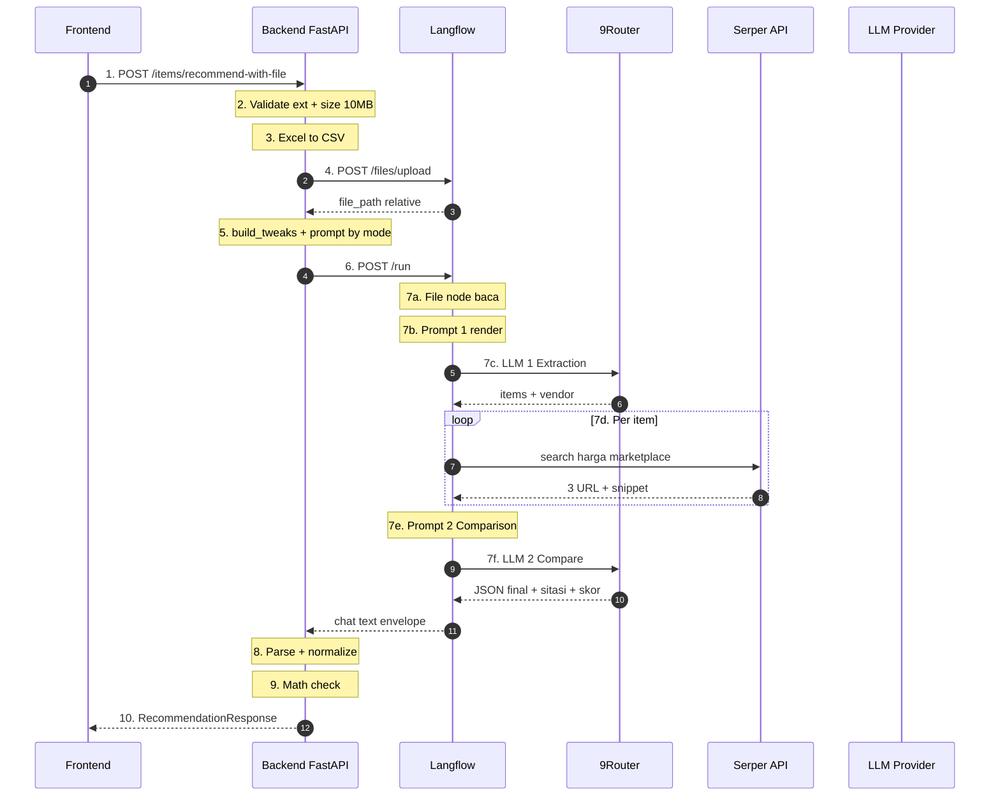
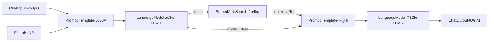
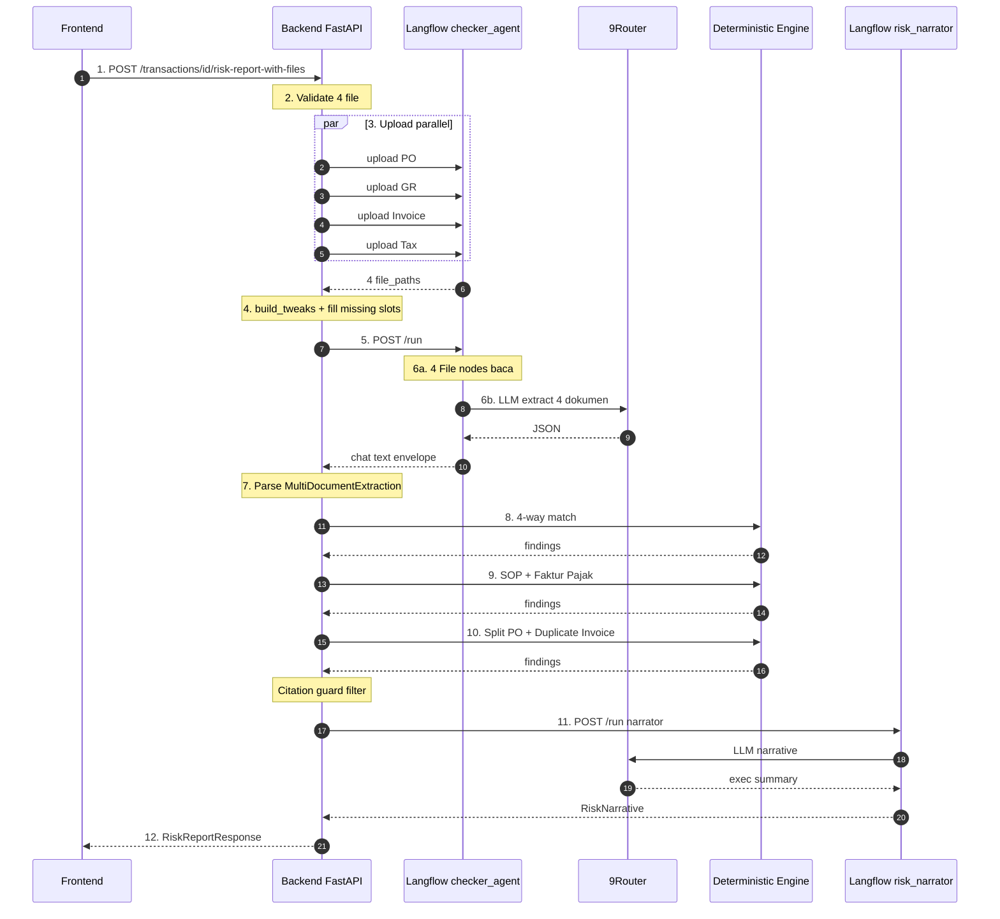
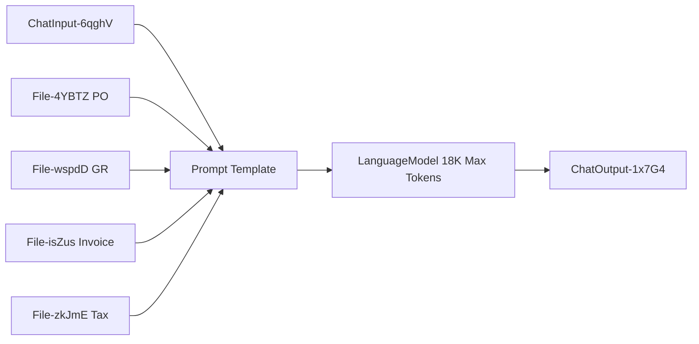
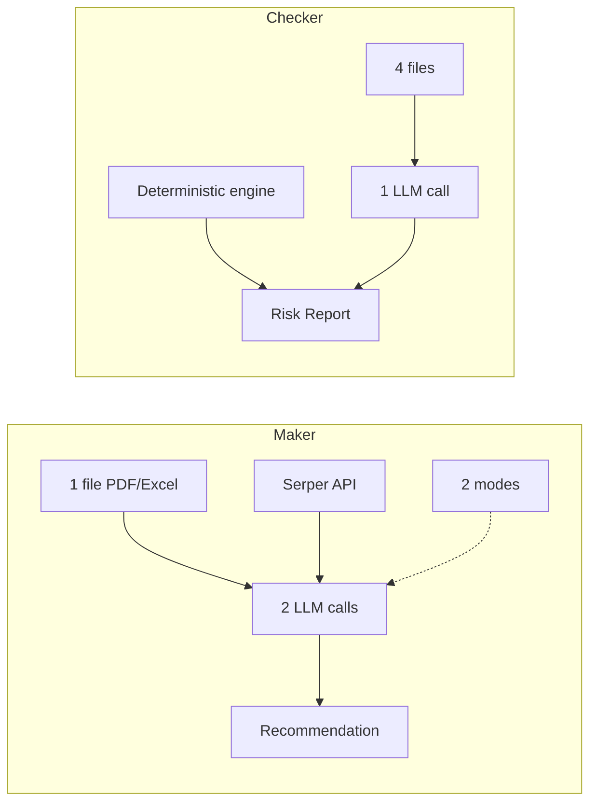
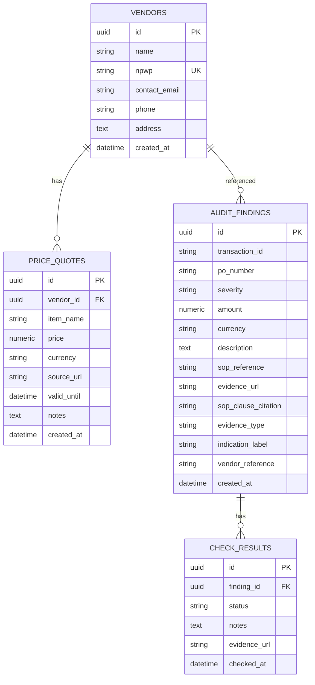
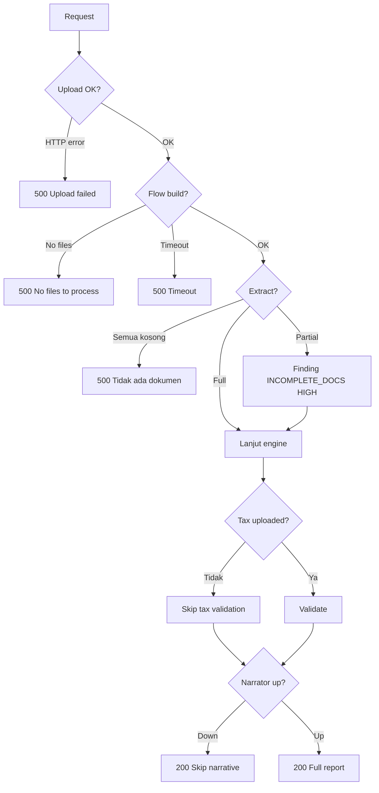

# Technical Deep Dive — Tilas

Dokumen ini menjelaskan secara detail alur **Maker Agent** dan **Checker Agent** di Tilas, dari frontend sampai Langflow dan kembali. Setiap diagram disertai penjelasan prose.

**Prinsip dasar:** *"LLM extracts, Python decides."* — LLM hanya untuk ekstraksi dan narasi; keputusan dan perhitungan di Python deterministik.

---

## Daftar Isi

- [Part 1 — Maker Agent](#part-1--maker-agent)
- [Part 2 — Checker Agent](#part-2--checker-agent)
- [Part 3 — Perbandingan Maker vs Checker](#part-3--perbandingan-maker-vs-checker)
- [Part 4 — Deep Dive Lanjutan](#part-4--deep-dive-lanjutan)

---

# Part 1 — Maker Agent

Maker Agent menerima satu file penawaran vendor **atau** BON Permintaan (PDF/Excel), mengekstrak item, mencari harga pasar via Serper, membandingkan, dan menghasilkan rekomendasi. Terdiri dari **10 tahap** dari frontend sampai response.

## 1.1 Alur Lengkap



## 1.2 Detail Tiap Tahap

### Tahap 1 — Frontend Submit

**File:** `frontend/src/hooks/useApi.js` → `useMakerRecommendation.submit`

User klik **Get Recommendation** setelah upload file + pilih mode. Frontend kirim FormData dengan field `item_name` (opsional), `mode` ('penawaran' atau 'bon'), dan `file` (PDF/Excel). Timeout 300 detik — sinkron dengan timeout Langflow.

### Tahap 2 — Backend Validasi

**File:** `backend/src/timbang/modules/procurement/service.py` → `get_recommendation_from_file`

Validasi ketat: ekstensi harus `.pdf`, `.xlsx`, atau `.xls`. Ukuran maksimal 10 MB. Minimal 4 byte (deteksi file kosong).

### Tahap 3 — Konversi Excel ke CSV

Kalau file `.xlsx` atau `.xls`, dikonversi ke CSV via `excel_to_csv_text(content)` (openpyxl). **Kenapa?** Langflow File node tidak bisa baca `.xlsx` direct tanpa Advanced Parser mode (Docling subprocess — berat dan error-prone). CSV lebih ringan, terstruktur, deterministic.

### Tahap 4 — Upload ke Langflow

POST ke `/api/v1/files/upload/{flow_id}` dengan multipart form. Respons berisi `file_path` yang bersifat **RELATIVE** (format `flow_id/timestamp_filename`) — bukan absolute path. Langflow resolve sendiri ke storage dir.

### Tahap 5 — Build Tweaks

**File:** `backend/src/timbang/shared/langflow/flow_meta.py`

Fungsi `build_tweaks()` membaca node ID dari JSON flow, generate `session_id` unik via `uuid4()`, lalu konstruksi dict `tweaks`. Tiga jenis tweak:

1. **ChatInput nodes** — inject `session_id`, `should_store_message=False`, dan `input_value`
2. **ChatOutput nodes** — inject `session_id`, `should_store_message=False`
3. **File nodes** — inject `path` dalam format list `[file_path]` (bukan string)

**Kenapa penting:**
- `session_id` unik per request → cegah cache nyangkut (bug yang kita fix — file B output dari file A)
- `should_store_message=False` → tidak nyampah di history Langflow
- `path: [list]` → format FileComponent Langflow 1.12.2

**Prompt override per mode:** Setelah `build_tweaks`, backend inject prompt berbeda:
- Mode `bon` → `tweaks["Prompt Template-J026A"] = {"template": _MAKER_PROMPT_BON}`
- Mode `penawaran` → `tweaks["Prompt Template-J026A"] = {"template": _MAKER_PROMPT_PENAWARAN}`

Karakter `{{` dan `}}` di konstanta Python → jadi `{` dan `}` literal setelah f-string render Langflow.

### Tahap 6 — POST Run ke Langflow

POST ke `/api/v1/run/{flow_id}` dengan body JSON berisi `input_value`, `input_type: chat`, `output_type: chat`, `session_id`, dan `tweaks`. Timeout 300 detik.

### Tahap 7 — Langflow Maker Flow Execution

**Flow structure:**



**7a. File Node Baca Dokumen** — File node resolve path dari tweaks. CSV (dari Excel) → parse langsung sebagai text. PDF → Docling subprocess → extract text. Output: raw text dokumen.

**7b. Prompt Template #1 (Extraction)** — Template yang di-override (BON atau Penawaran) dengan placeholder `{chat-input}` dan `{file}`.

**7c. LLM #1 — Extraction** — Model langflow via OpenAI Compatible → 9Router → Gemini/Groq/Cerebras (fallback chain). Task: ekstrak vendor + items dari dokumen. Output JSON berisi `vendor_name`, `vendor_contact`, `vendor_address`, `items[]`, `total_penawaran`, `terms`.

**7d. Serper Multi Search** — Custom component (didefinisikan di flow JSON) yang loop per item. Setiap item query ke Serper: `"harga {nama_item} tokopedia shopee lazada blibli"`, config `gl=id`, `hl=id`, `num=5`. Ambil 3 hasil organic teratas (title + URL + snippet).

**7e. Prompt Template #2 (Comparison)** — Template hardcoded di flow JSON. Instruksi: bandingkan harga vendor vs pasar, wajib sitasi URL, hitung `selisih_persen`, klasifikasi status (WAJAR/KOMPETITIF/PERHATIAN/TIDAK WAJAR), rekomendasi (SETUJU/NEGOSIASI/TOLAK).

**7f. LLM #2 — Final Analysis** — Output final berisi items lengkap dengan `harga_pasar_rata`, `selisih_persen`, `status`, `rekomendasi`, `sumber[]`, `alasan`. Plus kesimpulan dengan `total_penawaran`, `skor_vendor`, `estimasi_penghematan`.

**7g. ChatOutput** — Wrap JSON di response envelope: `{"outputs": [{"outputs": [{"results": {"message": {"text": "..."}}}]}]}`.

### Tahap 8 — Backend Parse + Normalize

Extract text dari envelope via `_extract_chat_text`. Parse JSON dengan `_try_parse_json` yang punya 3 attempt:

1. `json.loads(text)` langsung
2. Strip markdown fence → `json.loads`
3. Extract outermost `{...}` substring → `json.loads`

Normalize via `_normalize_llm_output`: konversi sentinel `"Data tidak tersedia"` → `None` untuk numeric fields; parse numeric string → float; filter sumber hanya URL valid (mulai `http`). Validate ke Pydantic `RecommendationResponse`.

### Tahap 9 — Math Check Deterministik

Verifikasi `sum(items.total_price_vendor)` vs `kesimpulan.total_penawaran`. Status:

- `OK` kalau selisih ≤ 1%
- `INFO` kalau selisih 9-13% (kemungkinan PPN)
- `WARNING` kalau selisih 1-5%
- `CRITICAL` kalau selisih > 5%

**Kenapa penting:** LLM bisa halusinasi angka. Math check verifikasi deterministik — kalau `sum(items) != total_penawaran`, ada yang salah.

### Tahap 10 — Response ke Frontend

Return `RecommendationResponse` dengan `vendor_name`, `items[]`, `kesimpulan`, dan math check fields. Frontend render panel (mode-aware).

## 1.3 Harga Pasar — Dari Mana?

**Jawaban singkat:** Bukan otomatis "paling mahal" atau "paling murah". **LLM yang menentukan** dari hasil pencarian Serper.

**Proses:**
1. Serper search per item: `"harga {nama_item} tokopedia shopee lazada blibli"`
2. Ambil 3 hasil organic teratas (title + URL + snippet)
3. LLM #2 dikasih 3 URL tersebut + instruksi "Harga pasar boleh diisi perkiraan range dari URL tersebut"
4. LLM memutuskan `harga_pasar_rata` — bisa rata-rata 3 URL, median, range min-max, atau harga dari URL paling relevan
5. Kalau tidak ada yang match → `null` / "Data tidak tersedia"

**Contoh nyata:**
- Laptop Asus VivoBook 14: 3 URL (7.099.000, 7.500.000, 6.800.000) → LLM pilih **7.099.000**
- Tinta Printer HP 85A: 2 URL (805.000, 890.000) → LLM pilih **805.000**
- WUNDER 200R (kain industri): tidak ada hasil relevan → LLM pilih **null** (Honest AI)

**Kenapa namanya `harga_pasar_rata` (rata-rata)?** Konvensi dari desain awal — asumsinya LLM akan rata-rata. Kenyataannya tidak selalu. Untuk hackathon, apa adanya sudah OK. Kalau ditanya juri: "Harga pasar adalah estimasi LLM dari hasil search marketplace, bukan rata-rata matematis — karena harga di marketplace sering berbeda varian/kondisi."

## 1.4 Output Backend — Schema Lengkap

### RecommendationResponse

| Field | Tipe | Deskripsi |
|---|---|---|
| `vendor_name` | `str \| None` | Nama vendor (None di mode BON) |
| `vendor_contact` | `str` | Email/telepon |
| `vendor_address` | `str` | Alamat |
| `items` | `list[RecommendedItem]` | List item |
| `kesimpulan` | `Kesimpulan \| None` | Ringkasan + skor |
| `raw_text` | `str \| None` | Fallback kalau parse gagal |
| `vendor_id` | `UUID \| None` | Legacy FK |
| `reason` | `str` | Legacy |
| `estimated_saving` | `Decimal` | Legacy |
| `citations` | `list[str]` | Legacy |

### RecommendedItem (per item)

| Field | Tipe |
|---|---|
| `nama_item` | `str` |
| `harga_vendor` | `float \| None` |
| `harga_pasar_rata` | `float \| None` |
| `selisih_persen` | `float \| None` |
| `status` | `str` |
| `rekomendasi` | `str` |
| `sumber` | `list[str]` |
| `alasan` | `str` |
| `qty` | `int \| None` |
| `satuan` | `str` |
| `total_price_vendor` | `float \| None` |

### Kesimpulan

| Field | Tipe |
|---|---|
| `total_penawaran` | `float \| None` |
| `total_pasar` | `float \| None` |
| `total_selisih_persen` | `float \| None` |
| `skor_vendor` | `float \| None` (0-100) |
| `rekomendasi_vendor` | `str \| None` |
| `estimasi_penghematan` | `float \| None` |
| `ringkasan_alasan` | `str` |
| `total_penawaran_calculated` | `float \| None` (dari math check) |
| `math_discrepancy` | `float \| None` |
| `math_discrepancy_percent` | `float \| None` |
| `math_check_status` | `"OK" \| "INFO" \| "WARNING" \| "CRITICAL"` |
| `math_check_note` | `str` |

## 1.5 Frontend Display — RecommendationCard

**1. Header** — Label mode-aware: "Harga yang Direkomendasikan" (Penawaran) atau "Rekomendasi BON Permintaan" (BON). Vendor name atau "Belum Ada Vendor". Badge "NEGOSIASI"/"SETUJU"/"TOLAK" (Penawaran) atau "Cari Supplier" (BON).

**2. MathCheckBanner** — Muncul kalau `math_check_status != "OK"`. CRITICAL merah, WARNING amber, INFO electric blue ("kemungkinan PPN").

**3. HeroStats — 3 kartu:**
- **Penawaran mode:** Total Penawaran / Estimasi Penghematan / Skor Vendor
- **BON mode:** Total Item / Sudah Ada Harga Pasar / Belum Ada Harga Pasar

**4. ItemsTable:**
- **Penawaran mode (8 kolom):** Item, Qty, Harga Vendor, Total, Harga Pasar, Selisih, Status, Rekomendasi
- **BON mode (5 kolom):** Item, Qty, Harga Pasar/Satuan, Estimasi Total, Rekomendasi

Estimasi Total = `qty × harga_pasar_rata` (hanya kalau `qty > 0` dan `harga_pasar != null`).

**5. SumberNotice** — Notice kalau ada item tanpa sumber URL.

**6. Ringkasan** — `kesimpulan.ringkasan_alasan`.

**7. Actions** — Tombol "Validate this price" hanya di mode Penawaran. Mode BON disembunyikan.

## 1.6 Poin Penting untuk Dijelaskan ke Juri

1. **Harga pasar ≠ average otomatis** — LLM estimasi dari 3 URL marketplace teratas
2. **LLM #1 dan LLM #2 terpisah** — extraction dulu, baru comparison
3. **Serper loop per item** — bukan 1 query untuk semua (lebih presisi, lebih lambat ~2 menit untuk 30 item)
4. **Math check deterministik** — verifikasi LLM tidak halusinasi angka
5. **Session isolation** — setiap request punya `session_id` unik

---

# Part 2 — Checker Agent

Checker Agent menerima 4 dokumen (PO, GR, Invoice, Faktur Pajak), mengekstrak via LLM, lalu menjalankan **deterministic engine** untuk 4-way matching, validasi SOP, faktur pajak, split PO, duplicate invoice. Terdiri dari **14 tahap**.

## 2.1 Alur Lengkap



## 2.2 Detail Tiap Tahap

### Tahap 1 — Frontend Submit

**File:** `frontend/src/pages/CheckerPage.jsx` → `handleUploadSubmit`

FormData berisi `tx_id`, 3 file wajib (`po_file`, `gr_file`, `invoice_file`), 1 file opsional (`tax_invoice_file`), dan 2 checkbox (`has_level2_approval`, `has_complete_docs`). Endpoint: `POST /api/v1/audit/transactions/{tx_id}/risk-report-with-files`.

### Tahap 2 — Backend Validasi

**File:** `backend/src/timbang/modules/audit/service.py` → `_extract_all_documents`

4 slot dokument dengan File node mapping:
- `po` (wajib) → `File-4YBTZ`
- `gr` (wajib) → `File-wspdD`
- `invoice` (wajib) → `File-isZus`
- `tax_invoice` (opsional) → `File-zkJmE`

Validasi: ekstensi `.pdf`/`.xlsx`/`.xls`, ukuran ≤ 10 MB, PDF magic bytes check (`b"%PDF-"` di 1024 byte pertama).

### Tahap 3 — Konversi Excel & Upload

Sama seperti Maker: Excel → CSV via `excel_to_csv_text`. Upload 4 file paralel (loop) via `_upload_file_to_langflow`, dapat `file_path` relative.

### Tahap 4 — Build Tweaks (Fix Slot Kosong)

**Yang unik di Checker:** kalau `tax_invoice_file` tidak di-upload, File node `File-zkJmE` masih perlu path atau Langflow error "No files to process".

Solusi:
1. `fallback_path = next(iter(uploaded_paths.values()))` — pakai file pertama yang sudah di-upload
2. Fill missing slot dengan `fallback_path`
3. `input_value` ditambah catatan: `"Dokumen berikut TIDAK disediakan oleh user: tax_invoice. Isi field terkait dengan null/kosong, jangan halusinasi."`

**Yang di-inject via tweaks:**
- `ChatInput-6qghV`: `{session_id, should_store_message=False, input_value}`
- `ChatOutput-1x7G4`: `{session_id, should_store_message=False}`
- `File-4YBTZ`: `{path: ["flow_id/po.pdf"]}`
- `File-wspdD`: `{path: ["flow_id/gr.pdf"]}`
- `File-isZus`: `{path: ["flow_id/invoice.pdf"]}`
- `File-zkJmE`: `{path: ["flow_id/po.pdf"]}` (fallback)

### Tahap 5-6 — Run Flow + Langflow Execution

**Flow structure (lebih sederhana dari Maker — 8 node, 7 edges, tidak ada Serper):**



LLM #1 (single call) ekstrak 4 dokumen → JSON dengan struktur `{po: {...}, gr: {...}, invoice: {...}, tax_invoice: {...}}`. Field per dokumen: `reference`, `date`, `vendor`, `items[]`, `amount`, `dpp`, `ppn`, `npwp`, `nomor_fp`.

### Tahap 7 — Backend Parse

`_parse_multi_document_extraction(text)` → `MultiDocumentExtraction` object.

**Penting:** Di sini LLM berhenti. Tidak ada comparison, tidak ada perhitungan. Semua logic selanjutnya murni Python deterministik.

### Tahap 8 — 4-Way Matching (Deterministik)

**Tolerances:**
- `TOLERANCE_QTY = 0.02` (±2%)
- `TOLERANCE_AMOUNT = 0.01` (±1%)

**Cek Qty:** Loop setiap PO item, find match di GR. Kalau tidak match → finding `INCOMPLETE_DOCS` HIGH. Kalau match, hitung `qty_diff_pct = abs(PO.qty - GR.qty_received) / PO.qty`. Kalau > 2% → finding `QTY_DISCREPANCY` HIGH dengan evidence `po:PO-2026-001` dan SOP clause.

**Cek Amount:** Loop GR dan Invoice, bandingkan dengan PO. Kalau `amount_diff_pct > 1%` → finding `PRICE_MANIPULATION` HIGH.

### Tahap 9 — SOP & Faktur Pajak Validation

**Threshold:**
- `SOP_L2_THRESHOLD = 100_000_000` (Rp 100 juta)
- `SPLIT_PO_WINDOW = 7` (hari)
- `DUPLICATE_WINDOW = 3` (hari)

**Cek L2:** Kalau `total_amount > 100jt` dan `not has_level2_approval` → finding `UNAUTHORIZED_APPROVAL` HIGH.

**Cek Faktur Pajak** (kalau tax_invoice ada):
- NPWP 15 digit — kalau tidak → `INCOMPLETE_DOCS` MEDIUM
- PPN ~11% DPP (tolerance ±0.5%) — kalau tidak → `PRICE_MANIPULATION` HIGH
- Nomor FP 16 digit — kalau tidak → `INCOMPLETE_DOCS` MEDIUM

### Tahap 10 — History Pattern Detection

**Split PO Detection:** Query `audit_findings` di mana `vendor_reference = npwp`, `evidence_type = 'PO_HISTORY'`, `created_at >= now - 7 days`, `amount < 100jt`. Kalau `count >= 2` dan `sum > 100jt` → finding `SPLIT_PO` HIGH.

**Duplicate Invoice Detection:** Query `evidence_type = 'INVOICE_HISTORY'` dalam 3 hari. Kalau reference sama persis → `DUPLICATE_INVOICE` CRITICAL. Kalau amount sama + vendor sama → `DUPLICATE_INVOICE` HIGH.

### Tahap 11 — Citation Guard

**Rule:** finding tanpa bukti dibuang.

```python
def _validate_citation(finding):
    has_evidence = bool(finding.evidence_url)
    has_sop = bool(finding.sop_clause_citation)
    return has_evidence or has_sop
```

Kenapa penting: mencegah halusinasi finding tanpa dasar. Setiap finding harus bisa di-refer ke dokumen atau SOP clause.

### Tahap 12 — Risk Score Aggregation

```python
SEVERITY_WEIGHTS = {
    "CRITICAL": 40,
    "HIGH": 20,
    "MEDIUM": 10,
    "LOW": 5,
}
risk_score = min(100, sum(SEVERITY_WEIGHTS[f.severity] for f in findings))
```

Contoh: QTY_DISCREPANCY (HIGH) + PRICE_MANIPULATION (HIGH) + DUPLICATE_INVOICE (CRITICAL) = 20 + 20 + 40 = 80. Di UI tampil 90 — kemungkinan ada bonus/bobot tambahan. Perlu verifikasi di kode.

### Tahap 13 — Risk Narrator (Layer 3, Opsional)

Flow terpisah: `langflow/risk_narrator.json` (4 node).

Kalau `LANGFLOW_NARRATOR_FLOW_ID` di-set, backend panggil narrator dengan context:

```text
Transaction: TRX-2026-001
Has Level 2 Approval: false
Total Findings: 3

Findings:
- [QTY_DISCREPANCY] HIGH: GR quantity 95.0 deviates...
- [PRICE_MANIPULATION] HIGH: ...
- [DUPLICATE_INVOICE] CRITICAL: ...
```

Output narrator (JSON): `{executive_summary, pattern_analysis, recommendations[]}`.

Narasi TIDAK mengubah verdict — hanya menambah narasi. Kalau narrator gagal, risk report tetap tersedia.

### Tahap 14 — Response ke Frontend

Return `RiskReportResponse` dengan `transaction_id`, `overall_status`, `severity`, `findings[]`, `risk_score`, `narrative`, `generated_at`, `has_level2_approval`.

## 2.3 Frontend Display — Risk Report Page

**Route:** `/checker/risk-report?tx=TRX-2026-001`

**7 Sections:**
1. **Header** — Transaction ID, timestamp, risk score 0-100 (besar, warna by severity)
2. **Severity Breakdown** — 4 bar (CRITICAL/HIGH/MEDIUM/LOW), jumlah finding per severity
3. **Verdict Summary** — Text list findings + overall status
4. **Ringkasan Eksekutif** — Paragraf naratif dari narrator + dampak finansial
5. **Pola Terdeteksi** — Bullet pattern analysis dari narrator
6. **Temuan** — Grouped by indication_label (mis. SELISIH KUANTITAS: 1 HIGH; MANIPULASI HARGA: 1 HIGH; INVOICE GANDA: 1 CRITICAL). Setiap temuan ada timestamp, description, evidence (`po:PO-2026-001`), SOP clause
7. **Recommended Actions** — 5 bullet actionable items dengan arrow

## 2.4 Poin Penting untuk Dijelaskan ke Juri

1. **LLM cuma extract, Python yang putuskan** — verdict, severity, citation semua deterministik. Bisa di-replay.
2. **Citation guard** — finding tanpa bukti dibuang otomatis
3. **6 fraud label** dengan formula presisi: qty ±2%, amount ±1%, L2 threshold Rp 100jt, split PO 2+ PO kecil 7 hari, duplicate invoice 3 hari, NPWP 15 digit / PPN 11% DPP / FP 16 digit
4. **Fallback slot kosong** — kalau tax_invoice tidak di-upload, File node diisi dummy
5. **Narrator opsional** — kalau down, risk report tetap tersedia
6. **Human-in-the-loop** — `check_results` table untuk reviewer ACCEPT/REJECT

---

# Part 3 — Perbandingan Maker vs Checker



| Aspek | Maker | Checker |
|---|---|---|
| Input | 1 file | 4 file |
| LLM calls | 2 (extract + compare) | 1 (extract saja) |
| External API | Serper | Tidak ada |
| Keputusan | LLM + math check | Deterministik penuh |
| Reproducible | Partial | Full |
| Mode | 2 (Penawaran/BON) | 1 |
| Durasi | ~2.5 menit | ~15-90 detik |
| Bisa jadi bukti audit | Tidak | Ya |

**Konsekuensi:** Checker bisa jadi bukti audit — kalau nanti diperdebatkan, tinggal re-run dengan input yang sama, output konsisten. Maker tidak bisa (LLM hasil bisa beda tiap run).


# Part 4 — Deep Dive Lanjutan

## 4.1 Formula Risk Score — Perlu Verifikasi

Tiga hipotesis kenapa 90 padahal weight total 80:

**Hipotesis A — Bonus dari CRITICAL + no L2:** Base = 80, bonus +10 kalau ada CRITICAL + transaksi > 100jt tanpa L2 → 90.

**Hipotesis B — Multiplier per CRITICAL:** Base = 80, `+ critical_count * 10` = 80 + 10 = 90.

**Hipotesis C — Weighted ratio:** Berbobot persen terhadap total finding — kemungkinan tidak match.

**Verifikasi:** jalankan `grep -n "risk_score\|SEVERITY_WEIGHT" backend/src/timbang/modules/audit/service.py`.

## 4.2 Database Schema



**Fungsi kolom penting di `audit_findings`:**

- `transaction_id` — grouping per transaksi (indexed)
- `indication_label` — 6 fraud label
- `severity` — aggregasi ke risk score
- `evidence_url` — reference dokumen (format `{doc}:{ref}`, mis. `po:PO-2026-001`)
- `evidence_type` — `DISCREPANCY`/`TAX_INVOICE`/`PO_HISTORY`/`INVOICE_HISTORY`/`SPLIT_PO`
- `vendor_reference` — NPWP untuk history detection (indexed)

**Contoh query Split PO:**

```sql
SELECT COUNT(*), SUM(amount)
FROM audit_findings
WHERE vendor_reference = :npwp
  AND evidence_type = 'PO_HISTORY'
  AND created_at >= now() - INTERVAL 7 DAY
  AND amount < 100000000;
```

**Contoh query Duplicate Invoice:**

```sql
SELECT * FROM audit_findings
WHERE vendor_reference = :npwp
  AND evidence_type = 'INVOICE_HISTORY'
  AND created_at >= now() - INTERVAL 3 DAY;
```

**Backfill:** setelah checker extract invoice baru, `_persist_invoice_history` insert ke `audit_findings` dengan `evidence_type='INVOICE_HISTORY'` supaya run berikutnya bisa cek duplikat.

## 4.3 Error Handling — 7 Level



| Level | Trigger | Response |
|---|---|---|
| 1 | Upload HTTP error | 500, tidak lanjut |
| 2 | Flow build error / timeout | 500, user lihat error Langflow |
| 3 | Partial extraction | 200, engine handle dengan finding |
| 4 | Semua field kosong | 500 "Tidak ada dokumen yang berhasil di-extract" |
| 5 | Item tidak match | 200, finding INCOMPLETE_DOCS |
| 6 | Tax invoice tidak di-upload | 200, prompt null + validation skip |
| 7 | Narrator down | 200, narrative kosong, report tetap keluar |

**Prinsip desain:**

- Gagal keras kalau input tidak bisa dibaca sama sekali (level 1, 2, 4)
- Gagal lunak + finding kalau partial (level 3, 5, 6)
- Fail-open untuk narrator (level 7)

## Kesimpulan

Tilas menerapkan prinsip *"LLM extracts, Python decides"*:

- **Maker** — LLM untuk ekstraksi + comparison, Python untuk math check. Cocok untuk rekomendasi harga yang butuh pemahaman kontekstual.
- **Checker** — LLM hanya ekstraksi, Python penuh untuk keputusan. Cocok untuk audit karena reproducible dan auditable.

Perbedaan arsitektur ini mencerminkan tujuan masing-masing: Maker untuk *decision support* (LLM-driven), Checker untuk *compliance audit* (Python-driven).
