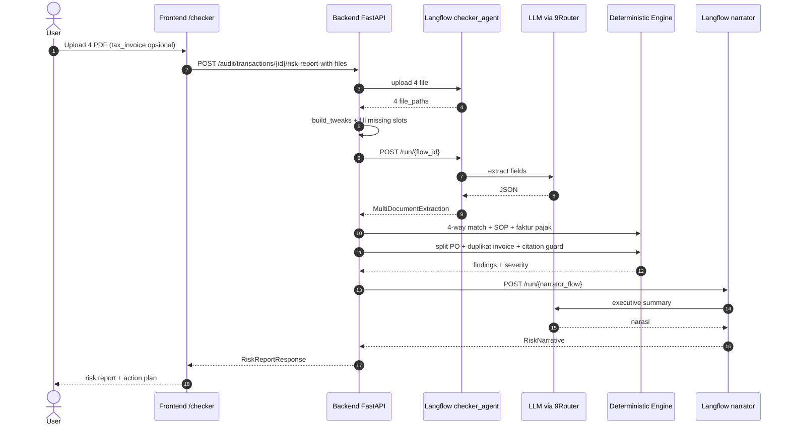

# Sequence Diagram — Checker Agent

Alur `/checker`: upload 4 PDF, 4-way matching, risk report.

```mermaid
sequenceDiagram
  autonumber
  actor User
  participant FE as Frontend /checker
  participant BE as Backend FastAPI
  participant LF as Langflow checker_agent
  participant LLM as LLM via 9Router
  participant Eng as Deterministic Engine
  participant Nar as Langflow narrator

  User->>FE: Upload 4 PDF (tax_invoice opsional)
  FE->>BE: POST /audit/transactions/{id}/risk-report-with-files
  BE->>LF: upload 4 file
  LF-->>BE: 4 file_paths
  BE->>BE: build_tweaks + fill missing slots
  BE->>LF: POST /run/{flow_id}
  LF->>LLM: extract fields
  LLM-->>LF: JSON
  LF-->>BE: MultiDocumentExtraction
  BE->>Eng: 4-way match + SOP + faktur pajak
  BE->>Eng: split PO + duplikat invoice + citation guard
  Eng-->>BE: findings + severity
  BE->>Nar: POST /run/{narrator_flow}
  Nar->>LLM: executive summary
  LLM-->>Nar: narasi
  Nar-->>BE: RiskNarrative
  BE-->>FE: RiskReportResponse
  FE-->>User: risk report + action plan
```
