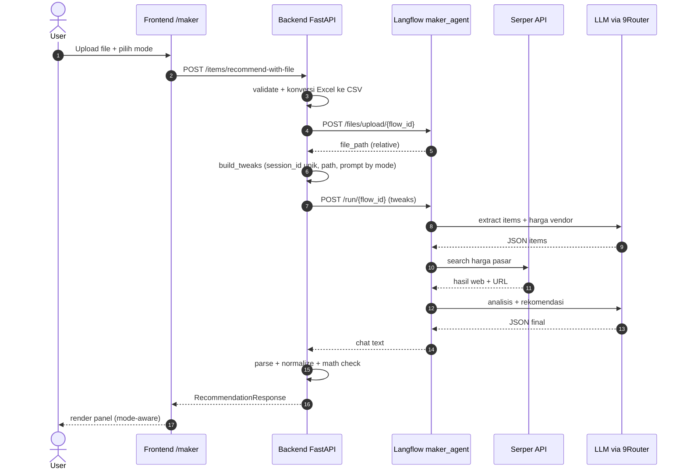

# Sequence Diagram — Maker Agent

Alur `/maker`: upload file, pilih mode, sampai render panel.

```mermaid
sequenceDiagram
  autonumber
  actor User
  participant FE as Frontend /maker
  participant BE as Backend FastAPI
  participant LF as Langflow maker_agent
  participant SP as Serper API
  participant LLM as LLM via 9Router

  User->>FE: Upload file + pilih mode
  FE->>BE: POST /items/recommend-with-file
  BE->>BE: validate + konversi Excel ke CSV
  BE->>LF: POST /files/upload/{flow_id}
  LF-->>BE: file_path (relative)
  BE->>BE: build_tweaks (session_id unik, path, prompt by mode)
  BE->>LF: POST /run/{flow_id} (tweaks)
  LF->>LLM: extract items + harga vendor
  LLM-->>LF: JSON items
  LF->>SP: search harga pasar
  SP-->>LF: hasil web + URL
  LF->>LLM: analisis + rekomendasi
  LLM-->>LF: JSON final
  LF-->>BE: chat text
  BE->>BE: parse + normalize + math check
  BE-->>FE: RecommendationResponse
  FE-->>User: render panel (mode-aware)
```
