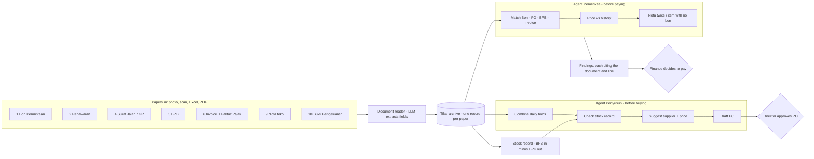

# System Flow — Visi End-to-End

Alur lengkap: dari dokumen fisik → arsip digital → agent penyusun (sebelum beli) → agent pemeriksa (sebelum bayar).

```mermaid
flowchart LR
  subgraph IN["Papers in: photo, scan, Excel, PDF"]
    direction TB
    d1["1 Bon Permintaan"]
    d2["2 Penawaran"]
    d4["4 Surat Jalan / GR"]
    d5["5 BPB"]
    d6["6 Invoice + Faktur Pajak"]
    d9["9 Nota toko"]
    d10["10 Bukti Pengeluaran"]
  end
  IN --> R["Document reader - LLM extracts fields"]
  R --> A[("Tilas archive - one record per paper")]
  A --> SL["Stock record - BPB in minus BPK out"]
  subgraph M["Agent Penyusun - before buying"]
    direction TB
    m1["Combine daily bons"]
    m2["Check stock record"]
    m3["Suggest supplier + price"]
    m4["Draft PO"]
    m1 --> m2 --> m3 --> m4
  end
  A --> m1
  SL --> m2
  m4 --> H1{"Director approves PO"}
  subgraph C["Agent Pemeriksa - before paying"]
    direction TB
    c1["Match Bon - PO - BPB - Invoice"]
    c2["Price vs history"]
    c3["Nota twice / item with no bon"]
  end
  A --> c1
  c1 --> c2 --> c3
  C --> T["Findings, each citing the document and line"]
  T --> H2{"Finance decides to pay"}
```
